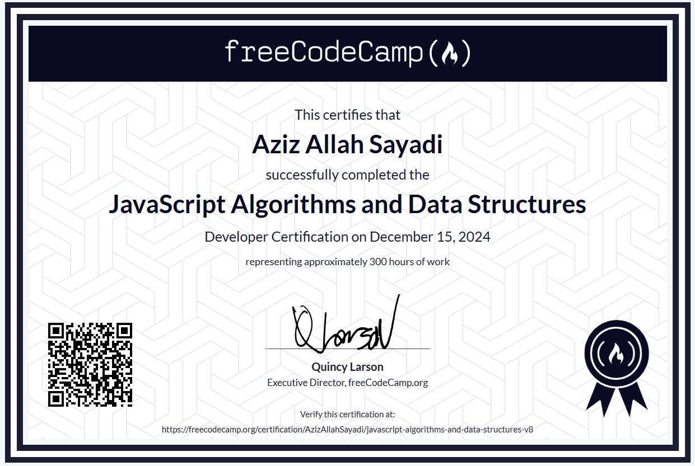
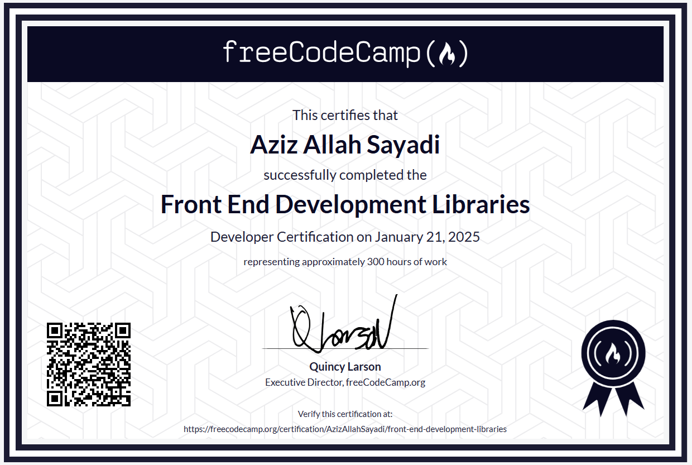
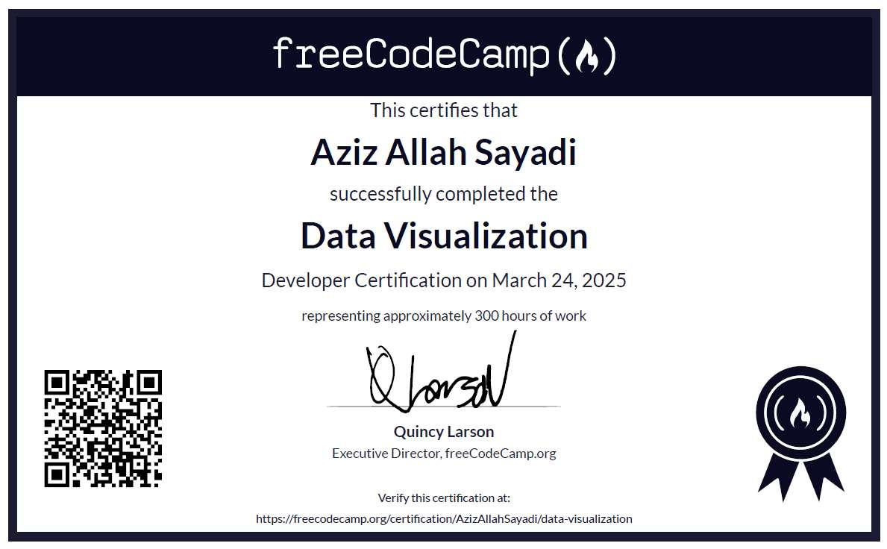
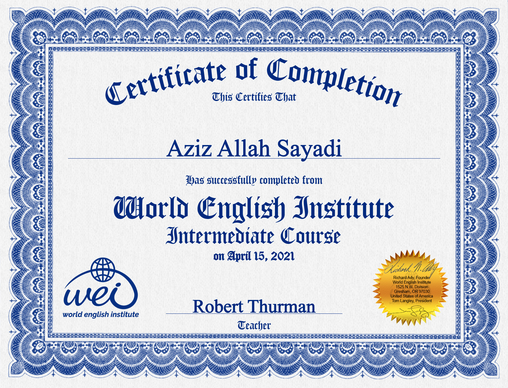

## Responsive Certificate
This certificate demonstrates proficiency in **HTML** and **CSS**.

## JavaScript Certificate
This certificate validates skills in **JavaScript Algorithms and Data Structures**.

1. Main Certificate 

2. Beta certificate 

## Front end Certificate
This certificate highlights expertise in **Bootstrap**, **React**, and **Redux**.

## Data Visualization
This certificate highlights expertise in **D3**, and **Data visualization**.

## English Intermediate Level Certificate
This certificate confirms an intermediate level of English proficiency.
 

>**Note**: Those with expertise in web design and programming will find my repository projects insightful and reflective of my skills.